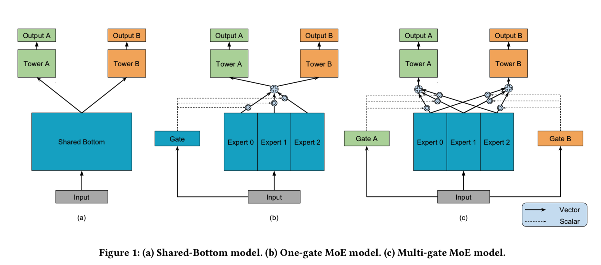
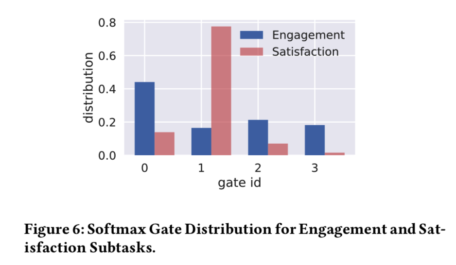
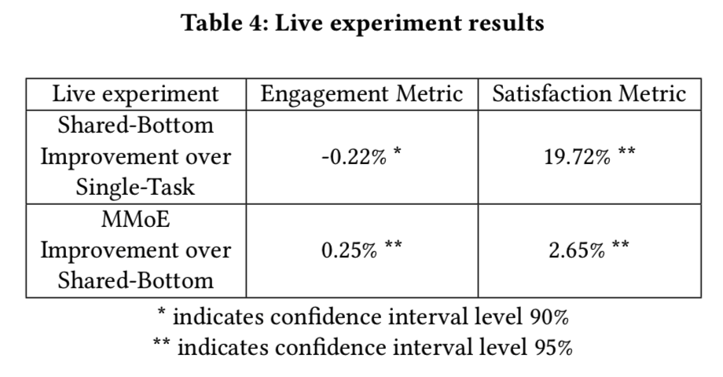

# Modeling Task Relationships in Multi-task Learning with Multi-gate Mixture-of-Experts
[pdf](https://dl.acm.org/doi/pdf/10.1145/3219819.3220007?download=true)

## tags
* KDD 2018
* Google
* Multi-task learning
* Neural networks

## Highlights
1. 解决多任务学习问题，是底层共享的进一步改进；
1. 为每个任务引入一个根据输入指定的门机制，让不同任务可以给不同的expert分配权重，从而有效引导模型的梯度传播；
1. 实验设置不是很完备，确认可以省空间和计算，但指标收益比较有限；

## Problem
1. 各种业务场景需要优化多个指标，以电影推荐系统为例，购买率和购买后的点赞率都要有提升；
1. 尽管多任务联合训练有效，但非常依赖数据分布，个别任务在参与联合训练之后效果是可能下降的；
1. 训练效果的下降来自于任务之间的关联性，但是直接测量这个关联性在实际任务中是不可行的；
1. 一些解法会引入更多的可训练参数，实操中不可接受；

## Related work
1. 底层共享，其有效性可以用可操纵相关性的人造数据集来验证；进一步的，可以把强共享变成对任务间参数增加L2约束，共享隐层，共享FM层等等；
1. MoE为多个隐层塔引入门机制，训练和评估阶段都带有稀疏性；PathNet会更极端，不同的worker从一个大网络里面裁剪出一个小的子路径网络来训练；

## Approach

### 绪论
1. Shared-bottom Multi-task Model（以下简称为SB）：`y[k] = h[k](f(x))`，f作为共享的隐层，每个任务在f的输出之上进一步堆叠全连接层；
1. 人造数据的必要性：任务的关联度会影响联合建模的效率，但实际数据很难操纵关联度；
1. 人造数据方法：构造两个正交单位向量u1 u2，用给定的-1到1之间的相关度系数，组合出两个权重系数w1 w2，进一步构造出带高斯白噪声的非线性目标函数y1 y2；
1. 相关系数越低，模型收敛性越差；

### 模型详解
1. 原始的MoE模型：pred = sum( g(x) * f(x, k) )，其中k指代第k个expert，g是个门函数，用来给不同的底层expert加权，f是底层的expert；
1. MMoE模型在MoE的基础上，为每个子任务单独构建函数g；
1. 本文的g是输入x的线性加权后，做了一个softmax；

## Experiments
### 人造数据
1. 构造了100维的输入，expert=8，对SB、OMoE、MMoE模型参数控制都大约是13056，Adam优化器；
1. 各种相关系数下，OMoE和MMoE都优于SB；在相关系数为1时，OMoE和MMoE的表现几乎一样；但当相关性下降到0.5之后，OMoE和MMoE的差距被大幅拉开；
1. 同时，将实验数据下钻为一个分布图，从稳定性角度也支持上述结论，并不只是“彩票”；

### 一个很小的真实数据集
1. 对比基准除了SB、OMoE、MMoE，还包括L2-Constrained、Cross-Stitch、Tensor-Factorization，会用贝叶斯优化工具来调超参；
1. Census-income数据集，来自1994美国人口普查，40个特征，29w样本，19w训练，9.9w测试；
1. 构造了两组测试：1）收入是否超过50k，从未结婚，相关性0.17；2）至少本科毕业，从未结婚，相关性0.23；
1. 婚姻状况都作为辅助任务，另一个作为主任务，测评时考察主任务的AUC；超参调优的依据也是主任务；
1. MMoE能比其他模型稍稍胜出，但超出的程度并不显著；

### Google的内容推荐实验
1. 更多场景：给定用户正在消费的内容，给出一个推荐列表供其继续消费；
1. 两类目标：1）消费类如点击率、消费时长；2）喜欢类如点赞率；
1. 已经有一个SB基线在线上运行；MMoE只需要将SB底层的最后一个隐层换成MMoE隐层，没有额外引入显著多的参数；
1. 用*300亿*样本训练，*1百万*评估，batch size=1024，点击率任务的auc约为*0.69*；
1. MMoE比SB在100亿训练样本时有0.15%的auc提升，在用完300亿后有0.08%的auc提升；OMoE会稍微略弱一些；
1. 将gate的门限可视化出来，会有下面这张图；

### Google的线上实验
1. Single：只用消费数据训练一个模型，预估值同时作为消费率和喜欢率的预估值；
1. SB：用消费和喜欢两个数据训练SB模型；
1. MMoE：用消费和喜欢两个数据训练SB模型；
1. 实验效果如下图

## 读后记
1. 其实就是把一个门限给向量化了；
1. 为什么线上实验对比的基线竟然是单个Single而不是两个Single？？？
1. 从省参数和计算量的角度看，确实效果显著；但是真正的目标指标的优化可能是十分有限的；

## References
* [简书的一个解读](https://www.jianshu.com/p/01802d61d8b6)
* [github的一个实现](https://github.com/drawbridge/keras-mmoe)
* [知乎：论文笔记：Multi-task Learning with MMoE](https://zhuanlan.zhihu.com/p/55161704)

## logs
* [ 2020-02-19 20:51:23 ] end
* [ 2020-02-19 15:49:25 ] begin

