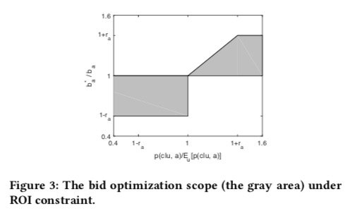

# Optimized Cost per Click in Taobao Display Advertising
[pdf](https://arxiv.org/pdf/1703.02091.pdf)

## logs
* [ 2020-01-27 23:52:57 ] end
* [ 2020-01-27 17:31:18 ] resume
* [ 2020-01-21 17:43:11 ] pause
* [ 2020-01-21 16:43:11 ] begin

## tags
* Alibaba
* KDD 2017
* Display Advertising
* Bid Optimization

## Highlights
1. 淘宝有足够转化数据，小广告主们更关注GMV，希望有一个调价机制能同时优化广告收益和GMV；
1. OCPC只调整出价，但不是单纯的面向ROI调价，二是考虑了后续的GSP拍卖，希望在保证广告主ROI的前提下，hack出一个后续经过GSP后能得到GMV最大的结果；
1. 用了一个经过多个角度近似简化的解法，实验结果非常正向，广告主-平台-用户win-win-win；
1. 因为有很多工业实践的考虑，细节没有披露的很充分，其实遗留了很多疑问；

## Problem
1. 淘宝的两种广告类型
  1. 首页顶部banner位置，可以放单品、店铺或品牌；
  1. 猜你喜欢列表页里面的单品，每200个会有3个是广告位；
1. 淘宝广告系统有别于其他平台的特点：
  1. 转化全链路数据可采集； 
  1. 广告主都是中小广告主，更关注短期可测量的GMV而不是影响力；
  1. CPC计费，尽管大家的投放KPI会不一样；
  1. *关注用户体验*，以CVR和GMV衡量，希望以做大盘子的方式来提高广告系统的预算容量；
1. 一般的CPC系统中，排序公式为eCPM=bid\*pctr，会造成两方面影响：
  1. 广告主对一个定向下的点击统一出价，效率有限，无法精细化的体现每个流量的具体价值；
  1. 这条公式是最大化单次请求的广告收益的，诸如GMV等用户体验的优化诉求无法体现；

## Related work
1. Google为代表的ECPC模式于2010年公开；
1. Facebook为代表的oCPM模式于2012年公开；

## Approach
### 系统架构
1. 披露了淘宝广告系统的整体架构，一个中心Merger负责串联用户画像、匹配、打分、创意优选等子服务；
1. 注释：值得注意的是，创意优选是放在排序定价阶段之后的，也就是说截至到17年，创意尚未作为重要因素加入到排序机制中来；
1. 注释：实时预估模型是MLR，尚未引入深度模型，但根据随后多篇论文的披露，实际上淘宝广告在深度模型上一路高歌猛进；

### OCPC策略原理
#### 可调节参数
1. 定义每个给定用户u和广告a，投资回报率 $$ ROI(u,a) = \frac{ pcvr(u,a) * value  }{ bid } $$，此处value是客单价，是个短期恒定的统计量，并且用bid来近似GSP中实际的计费值；
1. 上述公式对u取期望，得到 $$ ROI(a) = \frac{  E_u[ pcvr(u,a) ] * value  }{  bid } $$，换句话说，因为给定了落地页的value和出价，一个广告的投资回报率是正比于转化率的期望的；
1. 实际操作中，会记录下预估模型过去几天的预估值，掐掉头尾的10%来计算转化率的期望；
1. 优化目标是要保持ROI在优化后不变或有提升，因此需要保证 $$ \frac{obid(u,a)}{bid} \leq \frac{pcvr(u,a)}{ E_u[ pcvr(u,a)] } $$，由此可以将优于平均值的流量出价上调，差流量出价下调，形成一个调价的上下界；

#### 调价策略
1. 希望不改变原有的基于bid * pctr的GSP拍卖机制，所以只在上下界范围内调整bid，使得按照调整后的bid作GSP拍卖，胜出的N个广告能最大化一个目标函数f（在淘宝是GMV和拍卖收入的线性加权）；
1. 不加证明地引入第一个近似，目标函数是关于出价单调增的，即出价越高，获得的时候收益越大（注释：以GMV为例，obid是与转化率正相关的也就是和GMV正相关）；
1. 不加证明地引入第二个近似，以作为N=1情况下要优化目标函数的边界解法：按f(出价上界)对候选广告排序取第一个上界不小于其他所有广告下界的广告即可（注释：因为每个广告最多可以调节到上界，最低不小于下界，且f单调增）；
1. 对N>1的情况，用贪心算法解决：每次按N=1取出一个局部最佳候选a，然后缩小剩余候选的上界为a的上界；
1. 论文里举了一个很好理解的例子，不在此赘述了；

#### 工业实操的一些细节
1. 【q校正】预估系统对于转化率较高(pcvr > tc)的部分会出现约30倍的高估，用了一个校正公式将其校正回到5左右$$ tc * (1+log( \frac{pcvr}{tc} )) $$
1. 【模型选型】MLR模型，用户、广告、上下文三类特征以及他们的交叉，模型每天更新；
1. 【评估指标】用GAUC代替AUC进行模型效果评估，并且很重要的，*披露了一些模型的实际AUC指标*(注释：不到0.7的点击率模型auc，看起来还有很大优化空间)；

## Experiments
### 离线模拟
1. 直接上线做实验周期太长了，做了一个离线模拟环境，回放了20%一共约2000万个pv的出价记录，点击用pctr代替，点击后行为的模拟处理未交待；
1. 比较了四种策略：
  1. str0: 目前线上的排序策略；
  1. str1: 只考虑优化roi，按当前转化率和期望的比值来调价；
  1. str2: OCPC，目标函数是GMV；
  1. str3: 按pctr * pcvr * bid排序；
1. 三种策略相对基线都提高了cvr，但是奇怪的是str1提高的roi并不是最高的；
1. str2是综合来说对GMV和ROI都取得正向收益的版本；
1. top10的广告主有8个取得了ROI正收益，GPM基本都非负，大部分是砍PV的，但有一个广告主pv+50%（注释：因为没有披露各个指标的原始绝对值，实际上此处无法评判真正的有效换血效率）；
1. 再次强调，上述都是离线模拟的结果；

### 在线实验
1. 经过多轮离线模拟和在线小流量，最后用猜你喜欢场景总共九千万pv每天中的30% vs 30%流量做str0和str2的对比实验；
1. rpm+6.6%，gpm+8.9%，roi+2.1%，ctr-1.3%，cvr+5.2%；
1. 【广告主角度】67%的广告是GPM和ROI都提高的非常棒，24%涨pv但ROI略降属于可接受范围；细分的看，有大约一半的流量是按原出价出的，因为低估流量会被排序算法取上界即原价；
1. 【淘宝角度】头部的十个品类的pv变化都在正负10%以内，没有发生大规模的流量倾斜；影响62%pv的16%的品类是GPM和ROI均正向，影响21%流量的27%个品类GPM正向，影响12%流量的30%品类涨PV但ROI有下降；
1. 双十一期间广告主更关注加购物车行为而不是成交，16年双十一前做了一次针对加购的实验，有15.6%的加购率正向；

## 读后记
### Qs
1. 为什么可以用bid代替charge来计算ROI，这样得到的ROI是有效的吗？
1. 经过多个近似之后得到的obid真的是一次最优选择吗？分别拆分到当前这次请求、长远的考虑与未考虑广告主互动的三种情况下结论会有什么不同吗？
1. 为什么模型会出现30倍的高估？为什么只校正到约5倍左右？q校正对系统有什么影响吗？除了做校正还有什么办法吗？
1. GAUC在计算的时候会扔掉全0和全1的组，会有什么影响吗？尤其是在正样本稀疏的转化率场景下？

### 真正的读后感
长久以来，广告主和广告平台之间的博弈一直没有中断过，各种计费模式和拍卖模式可谓层出不穷，OCPX的模式应该是经过长久拉锯后的一个平衡点了。
从时间线看，谷歌2010，FB2012年有公开ocpx的记录；而国内的公司们也跟进的很快，凤巢大约是2014起步到2017左右成熟，从这篇论文看直通车是16年成熟，广点通和微信广告基本在18年也开始大规模推广。
以穿山甲为代表的一批新的广告系统更是激进的把ocpx进一步推广到双出价甚至是多阶段出价的形式，可谓是集大成者。

笔者有幸分别以平台和广告主的角度参与过三次ocpx系统的构建，虽然做的都比较浅显，还是可以感知到其中需要细究的优化点是非常多的。
多年后再次读到淘宝这篇论文不免感到眼前一亮，虽然还遗留了很多值得进一步讨论的疑问，但是无疑是很系统的总结了ocpx系统的诸多问题和解决思路，值得反复精读。

## References
* [谷歌的Enhanced CPC手册](https://support.google.com/google-ads/answer/2464964)
* [Facebook的oCPM手册](https://blog.adstage.io/2014/06/16/learn-about-facebook-ocpm-bidding)

