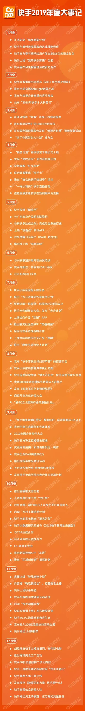

# 快手增长策略调研

## 有什么可借鉴的？
1. 分支版本可以打差异化，尤其是借鉴模仿竞品，可以起到渗透竞品用户的效果；
1. 应用商店可以贡献非常稳定的充沛的下载量，其中ios的下载量可能只有安卓的
1. 平台类产品做好垂类运营会产生虹吸效应，可以对一些本来非竞品的垂类流量直接吸收到自己平台上来；
1. 极速版的网赚模式可能已经过分成熟了，用户反向hack平台的手段太多，用户价值也可能偏低；

## 快手用户增长路径
### xx~2017
* 2011年3月，快手的前身：GIF快手诞生。
* 2013年10月，快手正式确定做短视频社交，自此快手的用户开始了迅速而稳定的增长。
* 2014 年春，宿华主导的算法上线，快手下载量斜率明显陡峭了起来。同年7月份，快手的日活用户就突破了百万人次，2015年1月就破了千万人次。
* 官方资料显示，2015年6月，快手用户破1亿，而仅仅8个月后，快手用户就达到3亿。
* 201604，经过了 1 年的甜蜜期(快手引流，YY变现)，快手上线直播功能，众多YY主播开始在快手“兼职”，而忙于应对映客、花椒、斗鱼等移动端直播的YY无暇他顾， 2017 年 3 月才出台规定严惩金牌主播外站兼职，但也已经无力逆转。
* 据企鹅智酷，2017年11月，MAU超过2亿，DAU/MAU=0.45，有超过35%的抖音用户同时使用快手，但随后这一比率有所下降。 

### 2018
* 据QuestMobile2018.1，女性占57.8%，24岁以下占66.6%，3000-8000元占52%，
* 据企鹅智酷，截至到2018年2月，快手的重合占比为14.6%，抖音为27.4%。
* 因为快手的种种问题，被央视点名批评，在2018年4月5日，快手在各大安卓应用平台下架。
* 2018年6月，快手完成对 Acfun （简称A站）的整体收购
* 钛媒体11月8日消息，在第五届世界互联网大会期间，快手宿华CEO宿华提供的数据显示，过去一年，超过1000万人已经在快手社区里获得了收入，通过直播、带货、代言的方式改善了自己的生活。在快手，每天有1.3亿人记录、分享和互动，并产生3亿次点赞。
* 据快手官方披露，截至2018年12月底，快手日活已突破1.6亿。
* 多个独立信源曾向36氪透露，快手在2018年的收入为200亿左右，其中大部分由直播贡献。
### 2019
* 20190529，快手副总裁王强透露，快手的日活跃用户已经突破了2亿。在2018年底，快手官方公布的DAU还仅为1.6亿。
* 201906 QuestMobile今年6月发布的报告显示，在短视频领域，抖音、快手竞争加剧，重合用户规模一年中翻番到1.6亿，今年两家均加速商业化变现的脚步。
* 201907 快手官方披露其一二线城市的日活跃用户从1月份的4000万涨到了6000万。
* 201908 快手极速版上线，采用与趣头条相似的网赚模式，主攻下沉市场，上线20天达到千万DAU，增长迅速。
* 10月21日，互联网大会, 宿华在发表演讲时披露，超过8000家政务号媒体号入驻快手；每天超3000万用户在快手看新闻。快手拥有2亿多生产者，日均新增视频超1500万，原创视频库存数量超过130亿条。
* 10月29日，过去一年，快手篮球视频创作者的数量已经达到150万，关注篮球创作者的粉丝数量累计超1亿，篮球类作品日均曝光次数超过1.6亿，有超过30万篮球作者在快手获得收益，合计收入超过6亿元。
* 根据易观千帆数据显示，截止2019年10月，快手极速版活跃用户规模环比增长49.67%，至5478.3万人，抖音极速版活跃用户规模环比增长69.84%，至1985.3万人。
* 201912 据《快手直播生态报告》，截止至11月底，直播DAU破亿，游戏直播DAU 5100w+;
* 2020年1月21日，据快手官方消息，快手商业“磁力引擎”超额完成2019年业绩目标，帮助20万快手创作者获得广告分成收入。目前，头部客户数量超过1000个，活跃商家数超过100万。
* “做个快手菜”从2019年12月16日开始到2020年1月12日结束，为期将近一个月，根据官方复盘的数据，参与该活动的视频作品超过7万，相关达人一共涨粉7139万。

### 2020
1. 春晚数据

## AARRR分解
### Acquistion用户获取
1. 应用商店(数据来自七麦，未采集小米市场的数据)
  1. 主app
    1. ios近30天日均下载量20w, 20191203至今有6次进入精品推荐，免费总榜#7，摄影与录像免费榜#2；免费总榜排名波动非常大，在#35~15#左右波动，期间短暂触达过top5；
    1. 安卓累计下载213亿，近30天日均下载4154w，TOP3: 华为1666w，拍摄美化#4；OPPO1400w，软件榜#6；百度666w，直播#1，热搜榜#19，飙升榜#20；
  1. 极速版
    1. ios近30天日均下载量3w，20160127至今无被官方推荐记录，免费总榜#19，摄影与录像免费榜#5；免费总榜排名有两个坑20190904 #112，20191112 #45，有大约两个月的滑坡-爬坡过程；
    1. 安卓累计下载11.2亿，30天日均下载1200w，TOP3：百度350w，热搜榜31w，新锐榜#63，飙升榜#23；华为333w，拍摄美化#3；OPPO300w，软件榜#12；
1. 广告投放
  1. adbug可监控到极速版大量的福利素材；主app素材会更丰富，短剧菜谱美女小游戏都有；
1. 线下广告
  1. 2020年春晚独家互动合作伙伴，10亿现金红包，30亿独家合作费用；

### Activiation用户激活
未发现有效公开数据；

### Retention用户留存
1. 未发现有效公开数据；
1. 从各种文章和分析报告看，社区化和多样化是快手分发内容的基础调性，由此产生了非常大量的腰部内容产出者，以及良好的社区互动氛围，关注页的渗透率会比抖音高很多；

### Revenue获得收益
1. 商业化：据Duo capital 分析师秋源俊二预测，2019年收入150亿；
1. 直播打赏分成：据Duo capital 分析师秋源俊二预测，2019年收入350亿；
1. 带货：未有公开数据；
1. 上述合计约500亿每年，按6亿MAU计算，LTV约在83左右；该数字可以强力反补到投放侧，允许非常激进的投放策略；

### Referral用户推荐
1. 分享：快手获得前8000万用户的主要手段；

## 不同垂类对增长的贡献
1. 直播，日活1亿，游戏类5000万；尤其值得注意的是，17年发生了一波YY主播向快手的迁移，可能同步带去了大量用户量；
1. 短剧，陈翔六点半1800w粉，作为快手对外投放的两个典型的短剧账号，一个粉丝数1100w，一个350w；但这两个账号的内容不管是拉新还是拉活都没有做针对性的落地页承接；
1. 教育，日均播放量22亿，点赞6kw，官方点名的优秀作者@戴博士实验室 粉丝数300万，@艺声欧巴的声乐课 粉丝数189万；160w付费用户；
1. 极速版，截止2019-10，DAU 5400w；网上存在很多快手提现失败的声音，而且能搜到大量“打开一个长视频播一天混金币”的攻略，极速版的长期效果可能有待进一步观察；
1. 2020春晚红包，快手春晚直播间累计观看人次7.8亿，最大的直播间峰值在线2300w，站外红包分享5.9亿次；预估DAU增量在2000万；
1. 运营：“做个快手菜”从2019年12月16日开始到2020年1月12日结束，为期将近一个月，根据官方复盘的数据，参与该活动的视频作品超过7万，相关达人一共涨粉7139万。

## 极速版
1. 提出的时机：2019.8，期间趣头条已上市一周年，用户得到广泛教育，但正在经历用户活跃度危机，快手K3战役刚宣布；
1. 和主版本的差异：安装包大小差异不大，功能差异不大，全屏单列模式，且多了一个福利球，观看视频计时，引导用户签到；
1. 抖音的跟进：8月末抖音迅速跟进，双列模式；双方都想互相渗透；
1. 获得的效果：根据易观千帆数据显示，截止2019年10月，快手极速版活跃用户规模环比增长49.67%，至5478.3万人，抖音极速版活跃用户规模环比增长69.84%，至1985.3万人；

## 参考资料
### 快手官方材料
* [2019快手直播生态报告：穿越平行世界](https://static.yximgs.com/udata/pkg/upload/%E7%A9%BF%E8%B6%8A%E5%B9%B3%E8%A1%8C%E4%B8%96%E7%95%8C%EF%BC%8812.10%EF%BC%89.pdf) by快手大数据研究院@20191210
* [2020春晚数据报告](https://weibo.com/7006475303/Ir6vLwXI4) by快手大数据研究院@20200125，发布在微博的一张长图；
* [2019快手教育生态报告](https://weibo.com/7006475303/IbVmfixwj) by快手大数据研究院@20191017，发布在微博的一张长图；
* [2019快手内容生态报告](https://weibo.com/7006475303/I6BQCwHH7) by快手大数据研究院@20190912，发布在微博的一张长图；
* [2019快手MCN发展报告](https://weibo.com/7006475303/HAJeJtXzb) by快手大数据研究院@20190626，发布在微博的一张长图；
* [2019小镇青年报告](https://weibo.com/7006475303/HsNjntgvB) by快手大数据研究院@20190505，发布在微博的一张长图；
* [快手上的幸福乡村](https://weibo.com/7006475303/HoHd5pzcQ) by快手大数据研究院@20190408，发布在微博的一张长图；
* [快手是什么--被看见的力量](https://item.jd.com/12768694.html) by快手研究院@20191201，一本文集，14篇行业文章+30篇快手用户的田野故事；

### 互联网公开文章
* [残酷底层物语：一个视频软件的中国农村真相](https://xw.qq.com/news/20160609003283/NEW2016060900328301) 2016年6月自媒体X博士的爆文，原文已删，这是一个备份
* [知乎：如何评价关于快手App的文章《残酷底层物语:一个视频软件的中国农村》？](https://www.zhihu.com/question/47249998) 
* [快手：嫌弃我low？那只是策略，很成功的策略](http://www.sohu.com/a/132364110_505837)
* [快手“三号人物”的突围战](http://china.36kr.com/p/5287138) 36kr转载自“互联网斗兽场”，报道快手高管马宏彬事迹，目前负责用户增长，文章没有具体提及增长策略，但有描写快手运营遇到的一些困境及做事风格；
* [前快手首席增长官：互联网下半场，如何破解产品的增长密码？](https://www.36kr.com/p/5285879) 应该是一门公开课的实录，没有提及快手的具体增长策略，但做了大量经验性总结；
* [以抖音、快手为例，拆解用户增长的四大环节和八大能力](https://www.jianshu.com/p/b9027a52dc86) 爱奇艺副总裁在GrowingIO的一个分享，以快手和抖音为案例；
* [快手DAU 5个月涨4000万 是什么在支撑它快速增长？](http://it.people.com.cn/n1/2019/0104/c1009-30505120.html) by环球网@19年初，是18年快手DAU从1亿增长到1.6亿的报道，没有内部消息，有作者的一些观察和总结；
* [快手直播日活用户突破1亿，新的增长点在哪？](https://tech.sina.com.cn/roll/2019-12-13/doc-iihnzhfz5647924.shtml) by界面@20191213，对快手直播生态报告做了二次解读；
* [快手10亿红包决胜春晚，只是红包发完钱用光了，快手真的赢了吗？](https://cj.sina.com.cn/articles/view/2219338054/8448694601900tasw) by江瀚视野@20200131，分析了红包活动的成功条件，简单列举了快手的投入金额；
* [2017：快手月活增长强劲飙升至前8](http://www.sohu.com/a/212855326_115376) by佚名@20171226，对联通大数据的12月app沃指数排行榜里快手位列第八的解读；
* [快手“3亿DAU”目标调整，计划春晚狠砸40亿元](https://tech.sina.com.cn/i/2019-10-18/doc-iicezzrr3046643.shtml) by36氪@20191018，解读了K3计划的细节调整，也回顾了快手近期的一些增长事件；
* [抖音与快手的最后战役](http://finance.ifeng.com/c/7sJar4H8Tvl) by蓝鲸财经@20191211，拼凑了一些其他文章有提及的信息；
* [年底冲刺3亿DAU，“慢公司”快手着急了](https://36kr.com/p/5216860) by王莹@20190618，解读宿华当天的快手内部信，附有内部信全文；
* [快手短剧成为我的新式电子咸菜](https://mp.weixin.qq.com/s/ddLYHhbVGoWEDmH3no9mcA) by院办小龙@20191009，以快手的网剧为楔子，介绍快手上内容的多样性；
* [“土味”视频中的幸福乡村，有六个想不到](http://k.sina.com.cn/article_1937192010_7377344a01900egw t.html) by田宇@20190403，对《快手上的幸福乡村》的解读；
* [今晚，快手能涨多少DAU？](https://36kr.com/p/5287950) by金龙聊运营@20200124，试图对快手除夕夜带来的DAU增量进行定量估计，但最后就是拍脑袋拍了个2000万；
* [宿华左右平衡，快手不再佛系](http://m.sohu.com/a/367977873_643517) by懂财帝@20200120，复盘了快手的一些发展历程，有提到几个关键节点的用户数字；
* [月活连续两个月下滑 头腾大战下尴尬的快手](http://finance.sina.com.cn/chanjing/gsnews/2018-06-25/doc-ihencxtu0365865.shtml) by左岸@20180625，解读了易观发布的201805短视频APP数据，快手月活2.3亿，但增长已负，同期抖音月活1.8亿，增长9.5%；
* [4亿用户与6000万的日活跃量背后：你不是不了解快手，只是不够了解中国社会](https://news.pedaily.cn/201705/20170526414167.shtml) by时代周报@20170526，2017腾讯投资跨手后对快手及公司的整体介绍；
* [快手的2019：从佛系到狼性](http://kuaibao.qq.com/s/20200121A0LBXM00) by今日网红@20200121，复盘了快手2019年的各种事件；
* [2019 抖音与快手的“攻守道”](http://www.techweb.com.cn/it/2020-01-06/2772394.shtml) by投中网@20200106，从几个角度盘点了快手和抖音的对抗；
* [快手联创杨远熙：许多南方快手用户已经投奔了抖音](http://www.techweb.com.cn/internet/2019-07-09/2743619.shtml) by凤凰科技@20190709，简短的报道了抖音崛起对快手的影响，没有新信息；
* [背靠腾讯加码游戏内容 快手入局电竞有何阳谋？](http://www.techweb.com.cn/internet/2019-08-16/2749759.shtml) by蓝鲸TMT@20190816，报道快手投资WE电竞俱乐部及延伸分析；
* [抖音、快手极速下沉欲寻新增长点 行业混战再建壁垒难](http://www.techweb.com.cn/internet/2019-10-25/2760506.shtml) by蓝鲸TMT@20191025，报道八月以来抖音和快手在极速版的争夺；
* [亿级新用户红利探秘：抖音、快手用户研究报告｜企鹅智酷](https://tech.qq.com/a/20180409/002763.htm) by企鹅智酷@20180409，从行业、消费者、创作者、用户流动和重度用户特写的角度调研当时的快手和抖音两个app；
* [黄子韬入驻快手一周，带来数千万新用户要代言快手？这波血赚](https://new.qq.com/rain/a/20200126A0HF3N00) by战锤游戏说@20200126，标题党，截止到20200204黄子韬快手账号粉丝数372w，抖音账号粉丝202w；
* [数据背后，快手超4亿月活的真实内容生态](https://new.qq.com/omn/20190929/20190929A0KJAU00.html) by深响@20190929，对《快手内容生态报告》做了二次解读；
* [焦点分析 | 抖音极速版，急速下沉](https://zhuanlan.zhihu.com/p/86884796) by36氪@20191015，解读了抖音极速版投放一个月的现象和数字；
* [快手发展史：一个从草根江湖到星辰大海的故事](http://www.yunying166.com/newsitem/278327983) 原作不详@20191015，对国金证券报告的二次解读，讲解快手的发展史；
* [国金证券:关于字节跳动的神话与现实(附PDF)](https://lmtw.com/mzw/content/detail/id/173554) by国金证券@20190806，国金证券对字节跳动的分析，属于比较大而全的分析；
* [快手专题分析报告：快即是慢，慢即是快](https://xueqiu.com/9508834377/134927630) by国金证券@20191030，国金证券对快手的分析报告，属于比较大而全的分析；
* [快手发布《2019磁力引擎年度报告》全年营收目标超额完成](https://baijiahao.baidu.com/s?id=1656390920535342280) by环球网@20200122，转载并解读了快手的《2019磁力引擎年度报告》；
* [快手能完成KPI吗？](https://baijiahao.baidu.com/s?id=1649224521211404426) by燃财经@20191104，报道解读快手近期将K3目标从DAU调整为峰值DAU事件；
* [快手商业化一周年硕果累累，继续有生活有生意](http://www.maad.com.cn/index.php?anu=news/detail&id=8244) by张婷@20191025，报道快手商业化一周年发布会；
* [回望2019: 快手的3亿DAU与300亿KPI](http://www.ebrun.com/20191225/366461.shtml) by春晚@20191225，回顾了快手的3亿DAU与300亿KPI的完成情况；
* [《2019抖音VS快手研究》：2大维度、10项对比，带你参透平台](https://www.jianshu.com/p/c71b66f4083d) by卡思数据@20190510；

